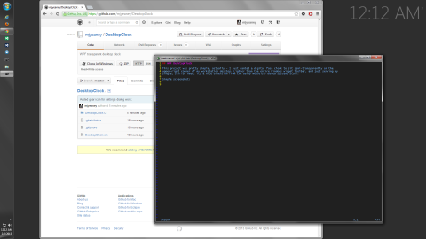

## WPF DesktopClock

This project was pretty simple, actually - I just wanted a digital face clock to sit semi-transparently on the
upper-right corner of my workstation desktop. Lighter than the entire Windows widget toolbar, and just serving my
single, selfish need, its a nice diversion from the daily web/distributed systems stuff.

Simple screenshot (note the upper right-hand corner):

